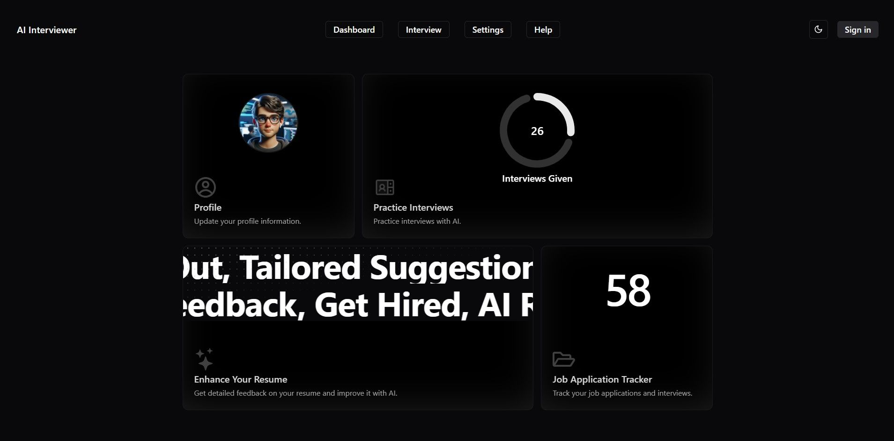
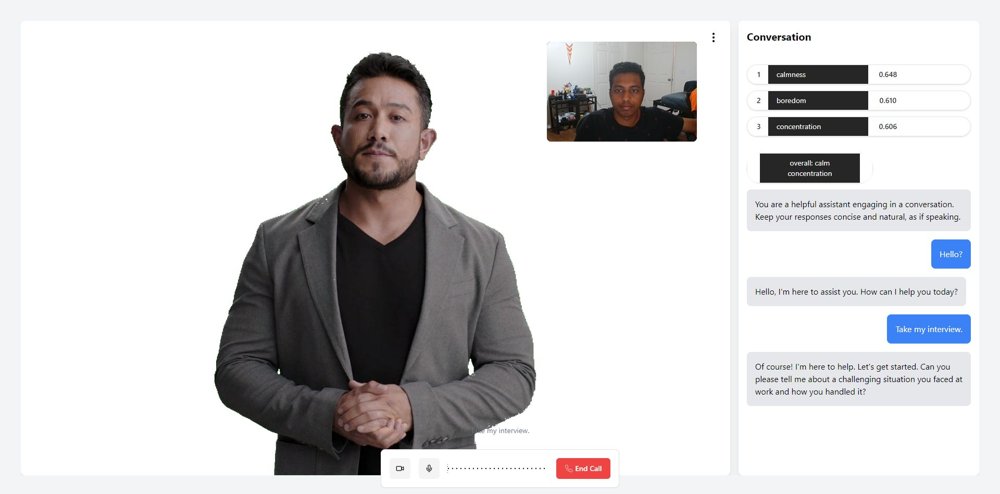

# 🤖 AI Interviewer

An interactive AI-powered interview web app built with the **T3 Stack**, designed to simulate real interviews through an AI avatar. It evaluates candidates based on **confidence**, **fluency**, and **technical understanding**, giving personalized feedback and insights — just like a real interview panel.

---

## 📸 Screenshots

### 🖼️ Landing Page 

### 🖼️ Interview in Progress  

---

## ✨ Features

- 🧠 **AI-Driven Interview**: Upload your resume and face real-time questions from an AI avatar.
- 🎙️ **Voice Input + Emotion Detection**: The app uses voice analysis and emotional cues to assess how confidently you speak.
- 📄 **Custom Assessments**: Get feedback on:
  - Confidence
  - Fluency
  - Technical skill
- 🎓 **Tailored Questions**: The AI adapts based on your resume to ask relevant questions.
- 🧾 **Report Card**: Visual breakdown of performance and recommendations.
- 🌐 **Authentication**: Seamless login/signup powered by Clerk.
- 🖼️ **3D AI Avatar**: Realistic avatar using Heygen, React Three Fiber, and HumeAI for expressive interaction.
- ⚡ **Fast, Private & Realistic**: Built with privacy and user experience in mind.

---

## 🛠 Tech Stack

- **Frontend**: Next.js, Tailwind CSS, React Three Fiber, NextUI, Zustand  
- **Backend**: tRPC, Prisma, NextAuth  
- **AI & Voice**: OpenAI, Gemini, Deepgram, HumeAI  
- **Auth**: Clerk  
- **3D Avatar**: Heygen, Drei  
- **Visualization**: Nivo Charts  

---

## 🚀 How It Works

1. 📄 Upload your resume (PDF/text).
2. 🧑‍💼 The AI avatar starts asking interview questions tailored to your background.
3. 🎙️ You respond via microphone; voice and facial expression analysis runs in real-time.
4. 📊 At the end, receive a performance breakdown and feedback.
5. 🔁 Use insights to prepare better for real interviews.

---

